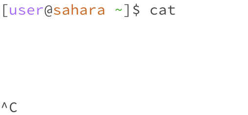

# For this lab report, we were required to test nine different cases between three commands: *cd* (change directory) , *ls* (list), and *cat* (concatenate). Here are the following results:

**1. cd (change directory)**

For this command, it required us to perform the cd line command in a terminal in our edstem workspace environment, without any parameters or arguments attached, and our working directory at the time was /home, as we had not done any modifications or changes to directory at that point. After using the cd command without any arguments, nothing happened, as demonstrated by the lack of change in the directory (still ~ without anything following, which indicated that no change in directory occurred, and that we are still within the /home working directory), which is because without an argument (in the form of a directory such as /messages), there is no directory to change to, and as such, we stay in the same directory. This is not an error. 

For this cd command, we used the cd line command in a terminal, with the argument of lecture1, which is a directory inside of the /home working directory, and using the cd line command on lecture1, we have changed directories on the second line, as indicated by [user/sahara ~/lecture1]. The reason it worked, was because we had an argument which was a directory which resided inside the current working directory, and such, cd was able to path us towards that inner directory of lecture1. This is not an error.

For this cd command, we use the cd line command in a terminal, with the argument of README file, which resides inside of the lecture1 directory, and using the cd line command on README, it shows an error, telling us that README is not a directory, so the directory itself is not changed either. The reason for this is because when we change directories, the arguments themselves have to be directories in and of themselves, and as such, going to a txt file, like README, instead of a path, wouldn't work.

**2. ls (list)**

For this command, it requires us to type ls, standing for list, into the terminal command line, and for this specific iteration, we type without an argument, so simply typing in ls, which then, when we press enter, lists out the files and folders within the given path, or which are under/inside the current working directory. For us, using ls without an argument prints out lecture1, which is the only file/folder under the current working directory of /home, because using ls without an argument lists only the most direct files/folders under the current directory. This is not an error.The working directory at that moment was /home, but since we are using ls, no change in directory is necessary.

For this ls command, we use the ls line command in a terminal, with the argument of our lecture1 path (which resides inside our current /home working directory), and when we press enter, what gets printed out are all the files/folder paths within the lecture1 folder/path, which include Hello.class, Hello.java, messages, and README. The reason why these files/folders were displayed are because for the argument, we specified that we want to use ls on the directory of lecture1, so it would print everything directly underneath lecture1, rather than from the root directory of /home. This is not an error. The working directory at that moment was /home, but since we are using ls, no change in directory is necessary.

For this ls command, we use the ls line command in a terminal, with the argument of the README file that resides within our lecture1 path, and when we press enter, it shows a similar error line to when we tried using cd towards README, because README isn't a directory, nor is it exactly a file which hosts any paths or files/folders underneath it. As such, there's an error, since there's nothing to display, and since README isn't a directory or file that has anything under it. The working directory at that moment was /home, but since we are using ls, no change in directory is necessary.

**3. cat (concatenate)**

For this cat command, we type in the command cat, with nothing as an argument, and what it does is lead us to lines without any directory or direction, just simply white space, and to exit out, we need to do the command ^C (control + C) to stop the process. This means that concatenating nothing keeps running, without ever stopping, which could result in a runtime error, as nothing is ever finished executing, so we are stuck if we choose to use cat without an argument. It might be an error, as it does not print out the contents of any files, yet still traps us within the space and infinitely runs without stopping. The working directory at that moment was /home, but since we are using cat, no change in directory is necessary.

For this cat command, we type in the command cat, with two arguments, that being the directories lecture1, as well as lecture1/messages, which then prints out messages stating that each respective argument is a directory. This is an error. The reason for this output, is purely because what we are concatenating are directories, which have files/folders within them that have printable contents, but not in these broader directories, so what cat tells us is that these are directories, not too disimilar from them telling us that README isn't a directory or file, because it can't print out anything for something as vague as a directory. The working directory at that moment was /home, but since we are using cat, no change in directory is necessary.

For this cat command, we type in the command cat, with two arguments, lecture1/messages/en-us.txt, as well as lecture1/messages/es-mx.txt, which then prints out the contents of both, separated by a line: Hello World! and ¡Hola Mundo! This is not an error. The reason for this output is because we have specified our arguments down to an absolute path showing two txt files, which contain text in them (Hello World!, and ¡Hola Mundo) that can be printed out, and when used with concatenate, it prints both of them out. The current working directory at the time was /home, but since cat does not change directories, we continue to reside within /home, and no change in directory is necessary. 
