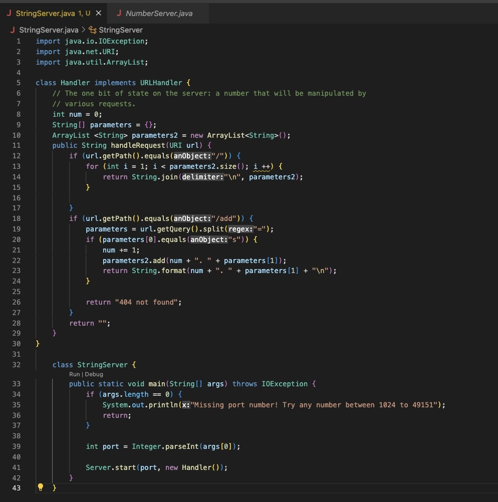

# **For the following lab report, three tasks were required of us. The first required creating our own local server webpage called StringServer, which housed a list of strings, a list which could be added to. Secondly, we were required to access the ssh keys which we generated earlier in the lab, both the private and public keys, and display them. We also had to show that we could ssh into our ieng6 accounts without need for a password. Lastly, we had to reflect on what we've learned that we didn't know before. Here are the results:** 

# **1. StringServer**

