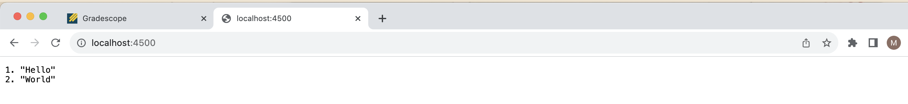
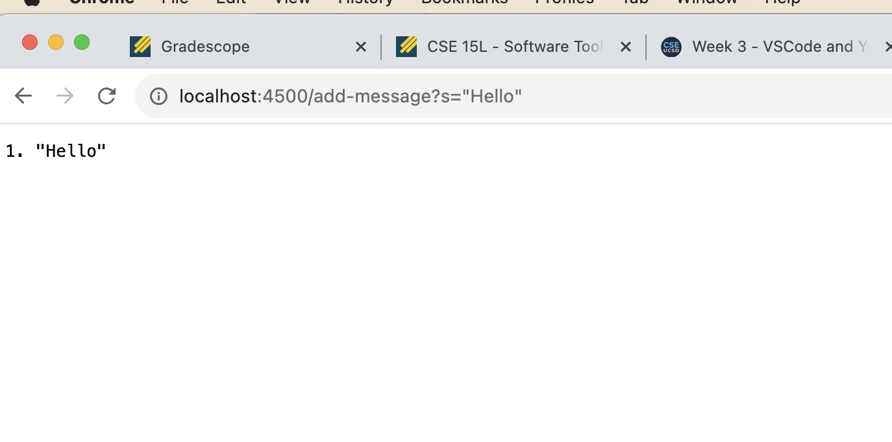
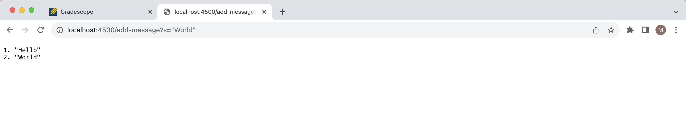
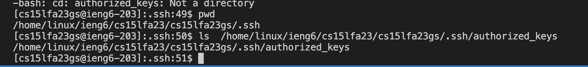
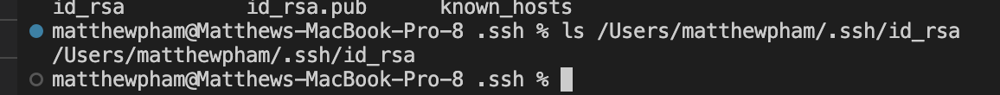
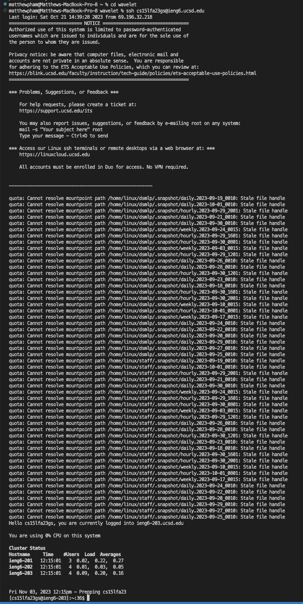

# **For the following lab report, three tasks were required of us. The first required creating our own local server webpage called StringServer, which housed a list of strings, a list which could be added to. Secondly, we were required to access the ssh keys which we generated earlier in the lab, both the private and public keys, and display them. We also had to show that we could ssh into our ieng6 accounts without need for a password. Lastly, we had to reflect on what we've learned that we didn't know before. Here are the results:** 

# **1. StringServer**

a) **StringServer Code**


b) **StringServer addHello**


- For this command, the methods called in our StringServer file are

```
    parameters = url.getQuery().split("=");
```

- Essentially performing two different methods as a result of the URI import, with ```.getQuery()``` as well as ```.split("=")``` which is called on the equals sign, the relevant argument to the split method. Of the relevant fields in the class, for parameters to be set to this, we have to run it through an if statement, which checks if ```url.getPath().equals("/")```, so that the split only happens when these conditions are met. The parameters array was changed in this case, from an empty array to being filled with the type of search query ("s", "q", etc.) and whatever arguments were inputted. 

``` 
    num += 1;
    parameters2.add(num + ". " + parameters[1]);
    return String.format(num + ". " + parameters[1] + "\n");
```
- Three methods in a row are performed following the if statement ```if (parameters[0].equals("s"))```, which change the relative fields of ```num``` (incrementing num), using the ```add``` method to the relative field of arrayList ```parameters2``` (such that it adds the string to the list), and then returns that exact string using the ```String.format``` method. The ```parameters2``` method is altered such that printing the arrayList on the home page would fill out accordingly. In this case, ```parameters[1]``` is equal to **hello**.


c) **StringServer AddWorld**


- For this command, the methods called in our StringServer file are

```
    parameters = url.getQuery().split("=");
```

- Essentially performing two different methods as a result of the URI import, with ```.getQuery()``` as well as ```.split("=")``` which is called on the equals sign, the relevant argument to the split method. Of the relevant fields in the class, for parameters to be set to this, we have to run it through an if statement, which checks if ```url.getPath().equals("/")```, so that the split only happens when these conditions are met. The parameters array was changed in this case, from an empty array to being filled with the type of search query ("s", "q", etc.) and whatever arguments were inputted. 

``` 
    num += 1;
    parameters2.add(num + ". " + parameters[1]);
    return String.format(num + ". " + parameters[1] + "\n");
```

- Three methods in a row are performed following the if statement ```if (parameters[0].equals("s"))```, which change the relative fields of ```num``` (incrementing num), using the ```add``` method to the relative field of arrayList ```parameters2``` (such that it adds the string to the list), and then returns that exact string using the ```String.format``` method. The ```parameters2``` method is altered such that printing the arrayList on the home page would fill out accordingly. In this case, ```parameters[1]``` is equal to **world**.


# **2. SSH Key Access**
a) **Path to ssh Keys (Public)**

- In the ssh login, we have demonstrated that when we ```ls``` into the ```authorized_keys``` path, it shows us the path to the public keys, which reside in ```/home/linux/ieng6/cs15lfa23/cs15lfa23gs/.ssh/authorized_keys```.

b) **Path to ssh Keys (Private)**

- In my own computer, we have demonstrated that in the ssh key, when we ```ls``` into the ```/Users/matthewpham/.ssh/id_rsa``` path, then it reveals to us the path of the private key, which is the same, otherwise known as ```/Users/matthewpham/.ssh/id_rsa```. 

c) **Terminal ssh without passwords**



# 3. **Reflection**

- In lab report from week two and three, I learned about what ```ssh``` is on a more in-depth level, and specifically what it's functions is, which definitely expands the amount of resources and files available to us (and it feels like hacking in a somewhat ethical sense). Perhaps more prescient was the idea of creating a local server running all by itself. Normally most websites I know are created from templates or borrowing domains, so learning to create one hosted on a local server was very revelatory. 
