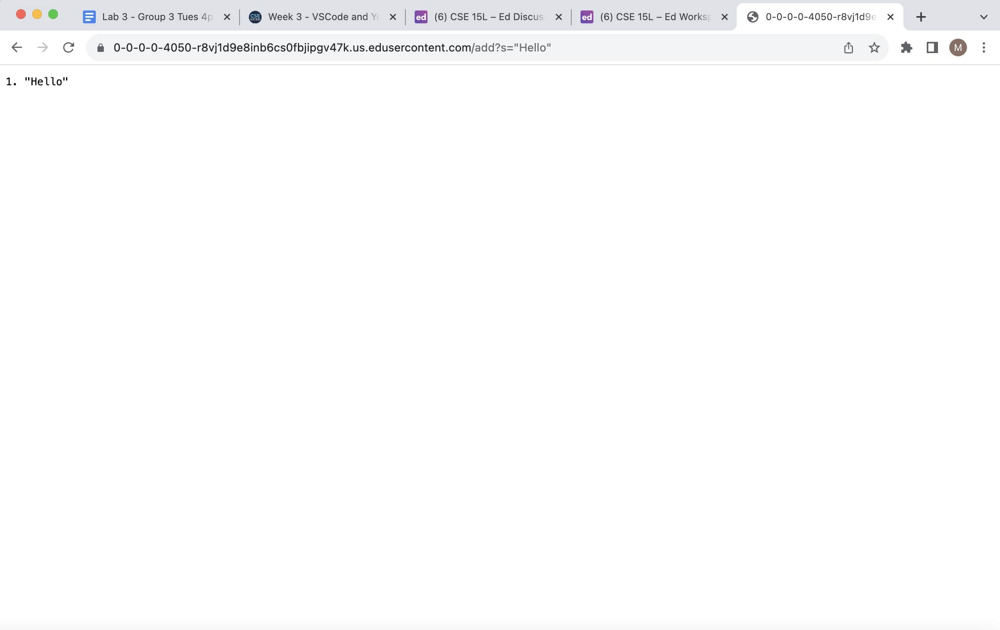

# **For the following lab report, three tasks were required of us. The first required creating our own local server webpage called StringServer, which housed a list of strings, a list which could be added to. Secondly, we were required to access the ssh keys which we generated earlier in the lab, both the private and public keys, and display them. We also had to show that we could ssh into our ieng6 accounts without need for a password. Lastly, we had to reflect on what we've learned that we didn't know before. Here are the results:** 

# **1. StringServer**

a) **StringServer Code**


b) **StringServer addHello**


- For this command, the methods called in our StringServer are
  ````
    parameters = url.getQuery().split("=");
````
- Essentially performing two different methods as a result of the URI import, with ```.getQuery()``` as well as ```.split("=")``` which is called on the equals sign, the relevant argument to the split method. Of the relevant fields in the class, for parameters to be set to this, we have to run it through an if statement, which checks if url.getPath().equals("/"), so that the split only happens when these conditions are met. The parameters array was changed in this case, from an empty array to being filled with the type of search query ("s", "q", etc.) and whatever arguments were inputted. 

 
if (parameters[0].equals("s")) {
    num += 1;
    parameters2.add(num + ". " + parameters[1]);
    return String.format(num + ". " + parameters[1] + "\n");
  }
