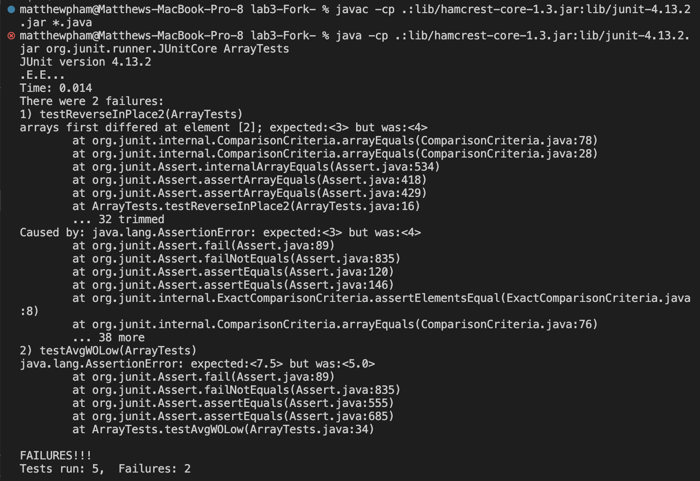
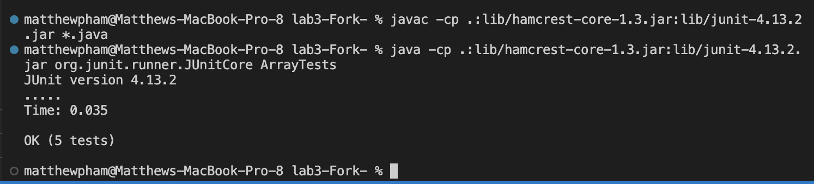

## **In this Lab Report, we are tasked with two individual assignments. The first will be to demonstrate bugs, symptoms, junit testing input, showing the bug beforehand, as well as how to fix such a bug. The second section revolves around researching different commands such as less, find, grep, etc. Here is the exploration of the bug I chose from Week 4 Lab, as well as the results I found from researching various commands.**

## **1) Bugs Examination: ArrayReversedInPlace**

**1a) A failure-inducing input for ArrayReversedInPlace**
- One Such failure-inducing input for ```ArrayReversedInPlace``` would be the following:

```
@Test
  public void testReverseInPlace2() {
    int[] input2 = { 3, 6, 5, 2 };
    ArrayExamples.reverseInPlace(input2);
    assertArrayEquals(new int[] { 2, 5, 6, 3 }, input2);
  }
```
- This is a Junit test, which tests the functionality of ```testReverseInPlace2``` which would cause an error output when using the junit compiling commands, and here is what the error specific to ```ArrayReversedInPlace``` would be:

```
1) testReverseInPlace2(ArrayTests)
arrays first differed at element [2]; expected:<6> but was:<5>
        at org.junit.internal.ComparisonCriteria.arrayEquals(ComparisonCriteria.java:78)
        at org.junit.internal.ComparisonCriteria.arrayEquals(ComparisonCriteria.java:28)
        at org.junit.Assert.internalArrayEquals(Assert.java:534)
        at org.junit.Assert.assertArrayEquals(Assert.java:418)
        at org.junit.Assert.assertArrayEquals(Assert.java:429)
        at ArrayTests.testReverseInPlace2(ArrayTests.java:16)
        ... 32 trimmed
Caused by: java.lang.AssertionError: expected:<6> but was:<5>
        at org.junit.Assert.fail(Assert.java:89)
        at org.junit.Assert.failNotEquals(Assert.java:835)
        at org.junit.Assert.assertEquals(Assert.java:120)
        at org.junit.Assert.assertEquals(Assert.java:146)
        at org.junit.internal.ExactComparisonCriteria.assertElementsEqual(ExactComparisonCriteria.java:8)
        at org.junit.internal.ComparisonCriteria.arrayEquals(ComparisonCriteria.java:76)
        ... 38 more
```
- The error is that the ``` assertArrayEquals(new int[] { 2, 5, 6, 3 }, input2);``` call turned out to be false, likely because the two inputs were not equal, as indicated that these arrays differed at element of index 2, where we expected ```6``` for both, but the ```ReversedInPlace``` ended up causing the wrong outputs.

**1b) Non-failure inducing Input for ArrayReversedInPlace**
- One such non-failure inducing output for ```ArrayReversedInPlace``` would be the following:

```
  @Test
  public void testReverseInPlace3() {
    int[] input2 = { 4 };
    ArrayExamples.reverseInPlace(input2);
    assertArrayEquals(new int[] { 4 }, input2);
  }
```

**1c) What are the symptoms for ArrayReversedInPlace?**

- For the failure-inducing input, the symptoms were as follows:
  

- The symptom is that the ``` assertArrayEquals(new int[] { 2, 5, 6, 3 }, input2);``` call turned out to be false, likely because the two inputs were not equal, as indicated that these arrays differed at element of index 2, where we expected ```6``` for both, but the ```ReversedInPlace``` ended up causing the wrong outputs.
 
- For the successful output, the symtpom was as follows (although it's not particularly a bad symptom):
 

- The symptom demonstrates that all tests run okay, and that the ```assertArrayEquals``` junit test passes, and works.

**1d) What is the bug? Demonstrate the before and after.**

- The bug of the function (beforehand) which results in the symptoms and failures is as such:

  ```
  for (int i = 0; i < arr.length; i += 1) {
      arr[i] = arr[arr.length - i - 1];
    }
  ```

  - The reason for this bug is mainly due to the idea of swapping finitely, such that if you have any amount of unique elements in an array, then eventually, at the halfway point, both sides of the array will be consisting of the same values, and so swapping is futile, since the original values of the first half have been overriden already. Thus, to fix this, I would argue to use a temp variable named ```temp``` or something of the like. Then you would set ```temp``` to the corresponding beginning of the array, make sure that the array only runs until halfway such that both sides stop once everything is properly reversed, and swap accordingly, such that the code after fixing the bug looks like such:

 ```
static void reverseInPlace(int[] arr) {
    int temp = 0;
    for (int i = 0; i < arr.length / 2; i += 1) {
      temp = arr[i];
      arr[i] = arr[arr.length - i - 1];
      arr[arr.length-i-1] = temp;
    }
```
- After this, everything gets swapped accordingly, the assertArrayEquals should be able to work.
- The fix addresses the issue, because now, for each corresponding element in the first half of the array, we store it in a ```temp``` variable, such that when that element gets changed to the same value as the last element, we still have stored that original first element somewhere. Then we can set that last element in the back half to the temp, so that these elements are properly reversed. We are only doing this up until the halfpoint of the array, if only because, at the halfway point, we have reversed every element. 


## **2) Command Line Investigation: ```grep``` and its Command Line Options**

**Preknowledge**: 
- The ```grep``` command essentially takes the form of the following: ```grep <<string>> <<files>>```. Essentially it searches through files (or multiple) until it finds the string specified in the command line. It then prints the lines which contain those exact strings. The files can be written as absolute paths as well. 

**2a) ```grep``` with command line option ```-i```**
- The first input I used with ```grep -i``` was as follows:

```
grep -i "Approaches" /Users/matthewpham/Documents/GitHub/docsearch/technical/biomed/gb-2002-3-12-research0088.txt
```
- This printed out the following: 

```
 Approaches using DNA microarrays have been successful in
          approaches based on pattern-recognition algorithms,
          computational approaches impracticable at present.
          data and other data-mining approaches will establish sets
```
- What this ```-i``` function is doing is searching the entire file of ```gb-2002-3-12-research0088.txt``` for the string ```"Approaches"```, where the ```-i``` function ignores capitalization, and prints out any line that contains ```approaches```, regardless of the capitalization, and this is useful when searching for any instance of a word through a file, and not having to run ```grep``` multiple times to find multiple instances where capitalization is different.

- The **second input** I used with ```grep -i``` was as follows:

```
grep -i "Approaches" /Users/matthewpham/Documents/GitHub/docsearch/technical/biomed/gb-2002-3-12-research0088.txt /Users/matthewpham/Documents/GitHub/docsearch/technical/biomed/gb-2002-3-12-research0086.txt
```
- This resulted in the following output:

```
/Users/matthewpham/Documents/GitHub/docsearch/technical/biomed/gb-2002-3-12-research0088.txt:        Approaches using DNA microarrays have been successful in
/Users/matthewpham/Documents/GitHub/docsearch/technical/biomed/gb-2002-3-12-research0088.txt:          approaches based on pattern-recognition algorithms,
/Users/matthewpham/Documents/GitHub/docsearch/technical/biomed/gb-2002-3-12-research0088.txt:          computational approaches impracticable at present.
/Users/matthewpham/Documents/GitHub/docsearch/technical/biomed/gb-2002-3-12-research0088.txt:          data and other data-mining approaches will establish sets
/Users/matthewpham/Documents/GitHub/docsearch/technical/biomed/gb-2002-3-12-research0086.txt:        approaches will substantially aid efforts to annotate these
/Users/matthewpham/Documents/GitHub/docsearch/technical/biomed/gb-2002-3-12-research0086.txt:        implications of our results for comparative approaches to
/Users/matthewpham/Documents/GitHub/docsearch/technical/biomed/gb-2002-3-12-research0086.txt:          EST/cDNA data exists will require alternative approaches,
/Users/matthewpham/Documents/GitHub/docsearch/technical/biomed/gb-2002-3-12-research0086.txt:          expression data implicit in current approaches to
```

- This printed out every line which contains the word ```"approaches"```, however this time across two different files: ```gb-2002-3-12-research0088.txt``` and ```gb-2002-3-12-research0086.txt```. It also ignores capitalization, and in this case, we can see that there is no capitalization of ```"approaches"``` in ```gb-2002-3-12-research0086.txt``` so it tells us the differences in these small usages.


- This was the website in which I discovered the ```grep -i``` command line option: [https://www.digitalocean.com/community/tutorials/grep-command-in-linux-unix]


**2b) ```grep``` with command line ```-c```**

- The **first input** I used with ```grep -c``` was as follows:

```
grep -c "Approaches" /Users/matthewpham/Documents/GitHub/docsearch/technical/biomed/gb-2002-3-12-research0088.txt
```
- The result was:

```
1
```

- The **second input** I used with ```grep -c``` was as follows:

```
grep -c "approaches" /Users/matthewpham/Documents/GitHub/docsearch/technical/biomed/gb-2002-3-12-research0088.txt
```

- The result was:

```
3
```

- The difference in results is due to capitalization. However, what the ```grep -c``` command really does is simply print out the **number** of lines which contain the specified string in the command line, which were ```1``` and ```3```, due to different capitalizations. This command line function is useful for streamlining the count on how many words exist in a certain file, like a word count of sorts.

- The same website was used for finding this command: [https://www.digitalocean.com/community/tutorials/grep-command-in-linux-unix]

**2c) ```grep``` with commandline line ```-n```**

- The **first input** I used with ```grep -n``` was:

```
grep -n "approaches" /Users/matthewpham/Documents/GitHub/docsearch/technical/biomed/gb-2002-3-12-research0088.txt
````

- The result was:

```
337:          approaches based on pattern-recognition algorithms,
341:          computational approaches impracticable at present.
584:          data and other data-mining approaches will establish sets
```

- The **second input** I used with ```grep -n``` was:

```
grep -n "Approaches" /Users/matthewpham/Documents/GitHub/docsearch/technical/biomed/gb-2002-3-12-research0088.txt
```

- The result was:

```
28:        Approaches using DNA microarrays have been successful in
```

- The difference in results is because there's only one instance of ```"Approaches``` where it is capitalized, and three instances, when ```"approaches``` is lower-case. Using ```grep -n``` gives us the line number which corresponds to when we find a specified string, which is helpful for keying in or finding the exact location of whatever strings we specify.

- The website I found this command line option on was much the same as before: [https://www.digitalocean.com/community/tutorials/grep-command-in-linux-unix]


**2d) ```grep``` with command line ```-v```**

- The **first input** I used with ```grep -v``` was:

```
grep -v "whistleblower" /Users/matthewpham/Documents/GitHub/docsearch/technical/plos/pmed.0020281.txt       
```

- And the output was:

```
 Whistleblowers serve no function if they cannot tell their stories. The present story of
        whistleblowing—as discussed, in part, in 
        PLoS Medicine —that involves the pharmaceutical industry, pharmaceutical
        benefit management corporations, the managed care industry, and the political and lobbying
        forces that zealously guard their secrets could not have been told without the help of
        courageous men and women [1, 2] For that reason, those of us who congregated in Washington,
        D.C., on May 15th, 2005, at the invitation and support of the Public Library of Science and
        the Government Accountability Project feel particularly humbled and grateful to these two
        sponsors. Our convictions could not have been aired were it not for the essential First
        Amendment work of responsible journalists, who exemplify the best in investigatory
        research.
        For me, whistleblowing is not a theoretical exercise. It has a human face and tangible
        features. It is the face of children and adults who have been injured or killed by
        misrepresented pharmaceuticals; clinical research trial results that have been sequestered
        from the scientific community and whose incomplete findings cause injury; and
        pharmaceuticals that are detailed to physicians, not to save lives or necessarily improve
        the health or welfare of the recipients, but to make money.
        passionate, and often successful, because our efforts have a different goal than the
        corporations and political interests whose operations we occasionally challenge. Our goal
        is to tell the truth. That honest effort is the source of any ethical difference we can or
        assault of unprecedented odds against being heard put forth by that sum of political power,
        expediency, and money.
        improve the status quo—be it in pharmaceutical marketing or managed-care decision
        making—cannot proceed or flourish without it.
        Ralph Waldo Emerson, American essayist and philosopher (1803–1882), commented about
        success (I have adapted his comments for all of us who gathered in Washington in mid-May
        2005): “To leave the world a bit better, whether by a healthy child, a garden patch or a
        redeemed social condition; to know even one life breathed easier because you have lived;
```

- The **second input** I used with ```grep -v``` was:

```
grep -i  -v "it" /Users/matthewpham/Documents/GitHub/docsearch/technical/plos/pmed.0020281.txt
```

- And the output was:

```
Whistleblowers serve no function if they cannot tell their stories. The present story of
        whistleblowing—as discussed, in part, in 
        PLoS Medicine —that involves the pharmaceutical industry, pharmaceutical
        courageous men and women [1, 2] For that reason, those of us who congregated in Washington,
        Amendment work of responsible journalists, who exemplify the best in investigatory
        research.
        misrepresented pharmaceuticals; clinical research trial results that have been sequestered
        pharmaceuticals that are detailed to physicians, not to save lives or necessarily improve
        the health or welfare of the recipients, but to make money.
        In the lonely and, at times, discouraging world of whistleblowing, we whistleblowers are
        passionate, and often successful, because our efforts have a different goal than the
        is to tell the truth. That honest effort is the source of any ethical difference we can or
        expediency, and money.
        A whistleblower's success depends upon competent and articulate media. The debate to
        Ralph Waldo Emerson, American essayist and philosopher (1803–1882), commented about
        success (I have adapted his comments for all of us who gathered in Washington in mid-May
        this is to have succeeded [as a whistleblower].”
```

- This time, I combined two different command line options, for the second example, ignoring capitalization (```-i```), and using the ```-v``` command in both, which printed every line in the ```pmed.0020281.txt``` file in the ```plos``` subdirectory that was not the specified string. It worked out quite well, and is a good way to print things out and filter out lines that contain certain phrases, such that you can go and then manually find and delete both of them.

- The website I used was much the same as the last three: [https://www.digitalocean.com/community/tutorials/grep-command-in-linux-unix]
