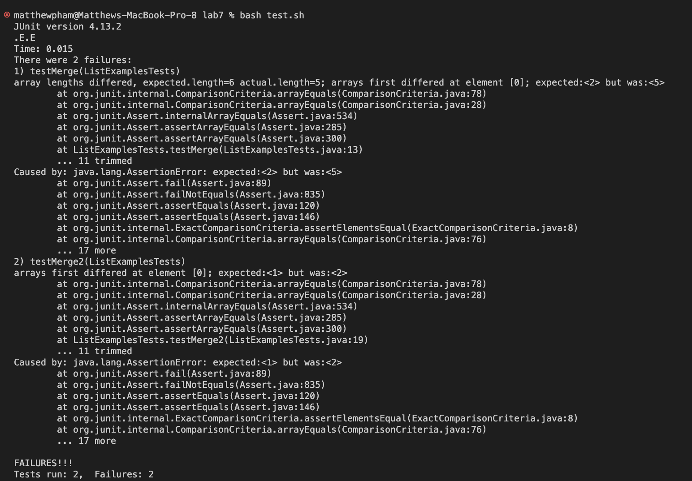
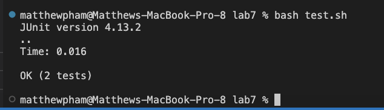
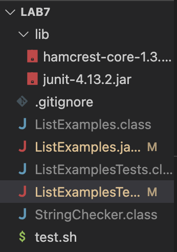
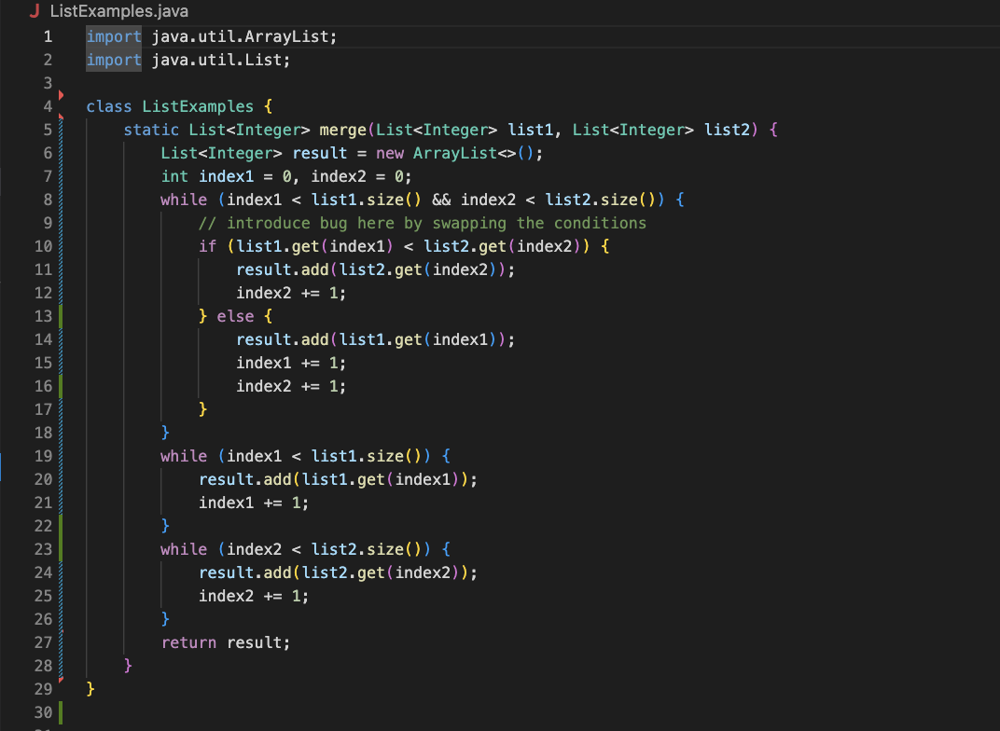
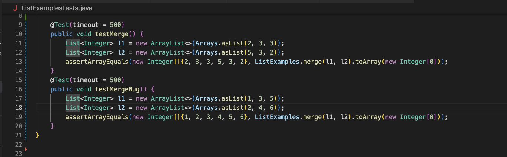
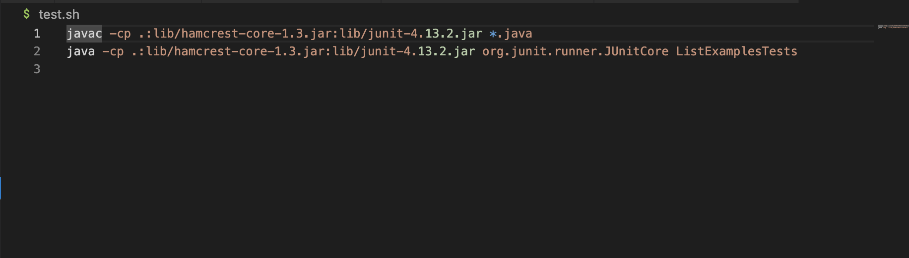
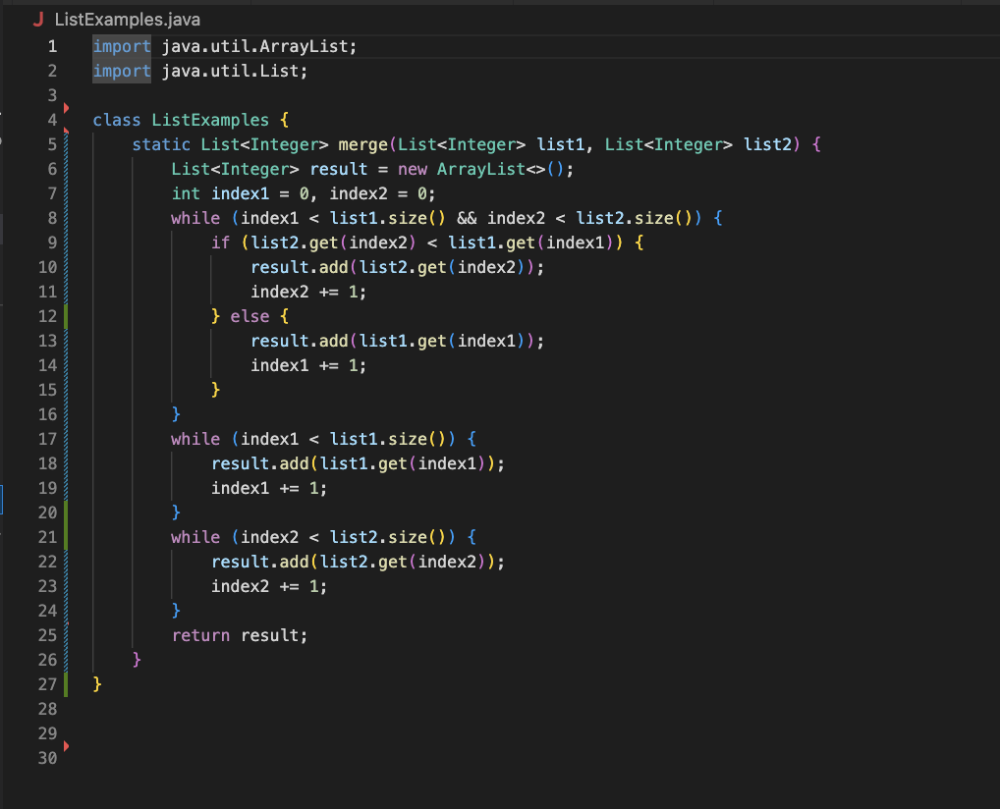

## **In this lab report, we are required to create a debugging scenario, which involves constructing an error-inducing function and bug, utilizing at least one bash script and one java script. We also create a conversation involving edStem, and making a post, while we have to respond as a TA with a leading question or a command. We must detail out every step of this process. Here is the conversation:**

## **1) EdStem Post and Response**
**Student**:
Hello, I'm currently experiencing issues with my code, which is to add together integer lists using a **merge** method, into one larger list, where we compare two indexed integers, and add the smaller number to the new list first, then add the other integers in later. However, I keep running into the following bugs, and can't decipher how to fix them. My guess here is definitely something to do with how the integers are being added to the merged list, and something going wrong there. As there are only two lists, the issue could be that I may have mistyped one of my calls to add, and so at some point, I added one integer instead of the other. Any advice would be helpful! I've included a screenshot below to showcase the bugs.



**TA Response (me)**: Hi Y/N! A private post with code would greatly help me resolve your issue here. However with what is given in the error, we know that there is likely more than a singular error. We can peg down the following:
- **Think about how your indexes are changing in your code**: Why are your indices never properly incremented to match the supposed correct examples in your junit tests? Where in your function do you think you may have incremented incorrectly? Find that, and think about how you can change that portion to properly increment. It could possibly be in more than a single place.
Once you've done that, try running your code again, and see if your junit tests work afterwards.

Best, 
TA

**Student changing the issue**: 




**Student**:
Hi thank you so much for the suggestions. I found out what the issue was with my code: it was twofold. The first issue was that in one of my lines of code, for the if statement that determines which integer to add first, it made it such that the greater integer of the two being compared was the one being added first, the complete opposite of what the intention of the merge function was. That was part of the issue that created the bug of improper matching. However, the second issue was that I had a separate indexing error. In my else statement, rather than only incrementing one of the indexes, as only one integer would be added, it incremented both indexes, and so, that was what was causing the error with regards to why the actual length was different from the expected length, one array was shorter than the other. Thank you!

**Full Breakdown of the debugging scenario**:

## - **File and Directory Structure**:




## - **Contents of All Files: Before**
  
**a**) **ListExamples.java**



**b**) **ListExamplesTests.java**



**c**) **test.sh**



## - **Contents of Files: After**

**a**) **ListExamples.java (Only One Altered)**



## - **Full Command Line to Trigger Bug**


## - **Description of how to fix the bugs**:

**a**) First, we need to fix the first ```if``` statement within the first ```for``` loop. It has it such that the statement checks and adds the greater number, ie. ``` if (list1.get(index1) < list2.get(index2))```. We must fix this, such that it becomes ```(list2.get(index2) < list1.get(index1))```. This partially contributed towards why we kept getting the wrong integers at the wrong indices. 

***b**) Second fix involves deleting a stray index incrementer, ie. the extra ```index2 += 1``` in the ```else``` statement of the first ```while``` loop. This extra increment was part of the reason for which the actual length of our list was never the same as what it was supposed to be. 


## **2) Reflection**


